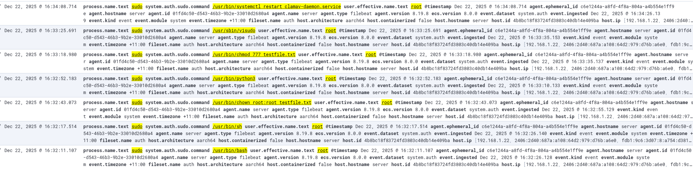

# Attack Commands
```
user@server:~ $ sudo bash
root@server:/home/user# exit
exit
user@server:~ $ sudo sh
# exit
user@server:~ $ sudo chown root:root testfile.txt 
user@server:~ $ sudo python3
Python 3.11.2 (main, Nov 30 2024, 21:22:50) [GCC 12.2.0] on linux
Type "help", "copyright", "credits" or "license" for more information.
>>> quit()
user@server:~ $ sudo chmod 777 testfile.txt 
user@server:~ $ sudo visudo
visudo: /etc/sudoers.tmp unchanged
user@server:~ $ sudo systemctl restart clamav-daemon.service
```
# Elasticsearch logs
# Elasticsearch logs

# Attack detection log
```
{
  "@timestamp": [
    "2025-12-22T05:34:33.787Z"
  ],
  "agent.ephemeral_id": [
    "c6e1244a-a8fd-4f8a-804a-a4b554e1ff9e"
  ],
  "agent.hostname": [
    "server"
  ],
  "agent.id": [
    "01fd4c50-d543-46b3-9b2e-33010d2680a4"
  ],
  "agent.name": [
    "server"
  ],
  "agent.type": [
    "filebeat"
  ],
  "agent.version": [
    "8.19.8"
  ],
  "ecs.version": [
    "8.0.0"
  ],
  "event.dataset": [
    "system.auth"
  ],
  "event.ingested": [
    "2025-12-22T05:34:26.139Z"
  ],
  "event.kind": [
    "signal"
  ],
  "event.module": [
    "system"
  ],
  "event.timezone": [
    "+11:00"
  ],
  "fileset.name": [
    "auth"
  ],
  "host.architecture": [
    "aarch64"
  ],
  "host.containerized": [
    false
  ],
  "host.hostname": [
    "server"
  ],
  "host.id": [
    "4b8bc18f83724fd3803c40db14e409ba"
  ],
  "host.ip": [
    "192.168.1.22",
    "2406:2d40:687a:a108:64d2:979:d76b:a6e0",
    "fdb1:9c6:3d07:8:a754:d381:9144:f4bc",
    "fe80::e392:9f16:e4d9:4c21",
    "172.17.0.1",
    "fe80::42:25ff:fea0:c907",
    "fe80::84dc:54ff:febc:cc88",
    "fe80::246e:54ff:fe6b:4092"
  ],
  "host.mac": [
    "02-42-25-A0-C9-07",
    "26-6E-54-6B-40-92",
    "2C-CF-67-5A-4D-0B",
    "2C-CF-67-5A-4D-0C",
    "86-DC-54-BC-CC-88"
  ],
  "host.name": [
    "server"
  ],
  "host.os.codename": [
    "bookworm"
  ],
  "host.os.family": [
    "debian"
  ],
  "host.os.kernel": [
    "6.6.47+rpt-rpi-2712"
  ],
  "host.os.name": [
    "Debian GNU/Linux"
  ],
  "host.os.name.text": [
    "Debian GNU/Linux"
  ],
  "host.os.platform": [
    "debian"
  ],
  "host.os.type": [
    "linux"
  ],
  "host.os.version": [
    "12 (bookworm)"
  ],
  "input.type": [
    "log"
  ],
  "kibana.alert.ancestors.depth": [
    0
  ],
  "kibana.alert.ancestors.id": [
    "AJuNRJsBf3bS5cEzP-Nq"
  ],
  "kibana.alert.ancestors.index": [
    ".ds-filebeat-8.19.8-2025.12.19-000001"
  ],
  "kibana.alert.ancestors.type": [
    "event"
  ],
  "kibana.alert.depth": [
    1
  ],
  "kibana.alert.intended_timestamp": [
    "2025-12-22T05:34:33.787Z"
  ],
  "kibana.alert.last_detected": [
    "2025-12-22T05:34:34.010Z"
  ],
  "kibana.alert.original_event.dataset": [
    "system.auth"
  ],
  "kibana.alert.original_event.ingested": [
    "2025-12-22T05:34:26.139Z"
  ],
  "kibana.alert.original_event.kind": [
    "event"
  ],
  "kibana.alert.original_event.module": [
    "system"
  ],
  "kibana.alert.original_event.timezone": [
    "+11:00"
  ],
  "kibana.alert.original_time": [
    "2025-12-22T05:34:08.714Z"
  ],
  "kibana.alert.reason": [
    "event with process sudo, by user on server created medium alert Sudo execution detection."
  ],
  "kibana.alert.reason.text": [
    "event with process sudo, by user on server created medium alert Sudo execution detection."
  ],
  "kibana.alert.risk_score": [
    47
  ],
  "kibana.alert.rule.actions.action_type_id": [
    ".index"
  ],
  "kibana.alert.rule.actions.frequency.notifyWhen": [
    "onActiveAlert"
  ],
  "kibana.alert.rule.actions.frequency.summary": [
    true
  ],
  "kibana.alert.rule.actions.group": [
    "default"
  ],
  "kibana.alert.rule.actions.id": [
    "6dc7fcdc-1753-4d31-81a2-e50eb0f0d3a7"
  ],
  "kibana.alert.rule.actions.params.documents.alert_type": [
    "Privilege Escalation"
  ],
  "kibana.alert.rule.actions.params.documents.description": [
    "Suspicious sudo command executed with root privileges"
  ],
  "kibana.alert.rule.actions.params.documents.process.name": [
    "sudo"
  ],
  "kibana.alert.rule.actions.params.documents.recommended_action": [
    "Verify if the command execution was authorized",
    "Review recent sudo activity for this user",
    "Check for persistence mechanisms or configuration changes",
    "Reset credentials if activity is suspicious"
  ],
  "kibana.alert.rule.actions.params.documents.risk_reason": [
    "Command executed via sudo that may allow privilege escalation or persistent system modification"
  ],
  "kibana.alert.rule.actions.params.documents.severity": [
    "high"
  ],
  "kibana.alert.rule.actions.params.documents.technique": [
    "T1068"
  ],
  "kibana.alert.rule.actions.uuid": [
    "ffa01009-8b95-42a2-beb3-0f4badc3c8e8"
  ],
  "kibana.alert.rule.category": [
    "Custom Query Rule"
  ],
  "kibana.alert.rule.consumer": [
    "siem"
  ],
  "kibana.alert.rule.created_at": [
    "2025-12-22T05:29:30.123Z"
  ],
  "kibana.alert.rule.created_by": [
    "elastic"
  ],
  "kibana.alert.rule.description": [
    "Detect successful sudo executions by non-admin users on Linux hosts."
  ],
  "kibana.alert.rule.enabled": [
    "true"
  ],
  "kibana.alert.rule.execution.timestamp": [
    "2025-12-22T05:34:34.010Z"
  ],
  "kibana.alert.rule.execution.type": [
    "scheduled"
  ],
  "kibana.alert.rule.execution.uuid": [
    "c7a1ec84-5af7-4612-9ac6-958cd56f9895"
  ],
  "kibana.alert.rule.from": [
    "now-6m"
  ],
  "kibana.alert.rule.immutable": [
    "false"
  ],
  "kibana.alert.rule.indices": [
    "apm-*-transaction*",
    "auditbeat-*",
    "endgame-*",
    "filebeat-*",
    "logs-*",
    "packetbeat-*",
    "traces-apm*",
    "winlogbeat-*",
    "-*elastic-cloud-logs-*"
  ],
  "kibana.alert.rule.interval": [
    "5m"
  ],
  "kibana.alert.rule.license": [
    ""
  ],
  "kibana.alert.rule.max_signals": [
    100
  ],
  "kibana.alert.rule.meta.kibana_siem_app_url": [
    "http://192.168.1.55:5601/app/security"
  ],
  "kibana.alert.rule.name": [
    "Sudo execution detection"
  ],
  "kibana.alert.rule.parameters": [
    {
      "severity": "medium",
      "max_signals": 100,
      "rule_source": {
        "type": "internal"
      },
      "risk_score": 47,
      "query": "process.name.text: \"sudo\" AND user.effective.name.text : \"root\" AND  system.auth.sudo.command: (*chown* OR *bash* OR *sh* OR *python* OR *chmod* OR *visudo* OR *systemctl* OR /usr/sbin/*)",
      "description": "Detect successful sudo executions by non-admin users on Linux hosts.",
      "index": [
        "apm-*-transaction*",
        "auditbeat-*",
        "endgame-*",
        "filebeat-*",
        "logs-*",
        "packetbeat-*",
        "traces-apm*",
        "winlogbeat-*",
        "-*elastic-cloud-logs-*"
      ],
      "language": "kuery",
      "type": "query",
      "version": 1,
      "rule_id": "21a89a5e-bf83-4b1c-b4bf-5e6025a2bb5d",
      "license": "",
      "immutable": false,
      "meta": {
        "kibana_siem_app_url": "http://192.168.1.55:5601/app/security"
      },
      "setup": "",
      "from": "now-6m",
      "to": "now"
    }
  ],
  "kibana.alert.rule.producer": [
    "siem"
  ],
  "kibana.alert.rule.revision": [
    0
  ],
  "kibana.alert.rule.risk_score": [
    47
  ],
  "kibana.alert.rule.rule_id": [
    "21a89a5e-bf83-4b1c-b4bf-5e6025a2bb5d"
  ],
  "kibana.alert.rule.rule_type_id": [
    "siem.queryRule"
  ],
  "kibana.alert.rule.severity": [
    "medium"
  ],
  "kibana.alert.rule.to": [
    "now"
  ],
  "kibana.alert.rule.type": [
    "query"
  ],
  "kibana.alert.rule.updated_at": [
    "2025-12-22T05:29:30.123Z"
  ],
  "kibana.alert.rule.updated_by": [
    "elastic"
  ],
  "kibana.alert.rule.uuid": [
    "a1e4c85c-3d90-45f0-96cc-0a7b38fedbce"
  ],
  "kibana.alert.rule.version": [
    "1"
  ],
  "kibana.alert.severity": [
    "medium"
  ],
  "kibana.alert.start": [
    "2025-12-22T05:34:34.010Z"
  ],
  "kibana.alert.status": [
    "active"
  ],
  "kibana.alert.uuid": [
    "49bbd13260d57ca6fcfe28b4278290a5778d561147ed809a9407226d454a66da"
  ],
  "kibana.alert.workflow_status": [
    "open"
  ],
  "kibana.space_ids": [
    "default"
  ],
  "kibana.version": [
    "8.19.8"
  ],
  "log.file.path": [
    "/var/log/auth.log"
  ],
  "log.offset": [
    79265
  ],
  "process.name": [
    "sudo"
  ],
  "process.name.text": [
    "sudo"
  ],
  "related.hosts": [
    "server"
  ],
  "related.user": [
    "user",
    "root"
  ],
  "service.type": [
    "system"
  ],
  "signal.ancestors.depth": [
    0
  ],
  "signal.ancestors.id": [
    "AJuNRJsBf3bS5cEzP-Nq"
  ],
  "signal.ancestors.index": [
    ".ds-filebeat-8.19.8-2025.12.19-000001"
  ],
  "signal.ancestors.type": [
    "event"
  ],
  "signal.depth": [
    1
  ],
  "signal.original_event.dataset": [
    "system.auth"
  ],
  "signal.original_event.kind": [
    "event"
  ],
  "signal.original_event.module": [
    "system"
  ],
  "signal.original_event.timezone": [
    "+11:00"
  ],
  "signal.original_time": [
    "2025-12-22T05:34:08.714Z"
  ],
  "signal.reason": [
    "event with process sudo, by user on server created medium alert Sudo execution detection."
  ],
  "signal.rule.created_at": [
    "2025-12-22T05:29:30.123Z"
  ],
  "signal.rule.created_by": [
    "elastic"
  ],
  "signal.rule.description": [
    "Detect successful sudo executions by non-admin users on Linux hosts."
  ],
  "signal.rule.enabled": [
    "true"
  ],
  "signal.rule.from": [
    "now-6m"
  ],
  "signal.rule.id": [
    "a1e4c85c-3d90-45f0-96cc-0a7b38fedbce"
  ],
  "signal.rule.immutable": [
    "false"
  ],
  "signal.rule.interval": [
    "5m"
  ],
  "signal.rule.license": [
    ""
  ],
  "signal.rule.max_signals": [
    100
  ],
  "signal.rule.name": [
    "Sudo execution detection"
  ],
  "signal.rule.risk_score": [
    47
  ],
  "signal.rule.rule_id": [
    "21a89a5e-bf83-4b1c-b4bf-5e6025a2bb5d"
  ],
  "signal.rule.severity": [
    "medium"
  ],
  "signal.rule.to": [
    "now"
  ],
  "signal.rule.type": [
    "query"
  ],
  "signal.rule.updated_at": [
    "2025-12-22T05:29:30.123Z"
  ],
  "signal.rule.updated_by": [
    "elastic"
  ],
  "signal.rule.version": [
    "1"
  ],
  "signal.status": [
    "open"
  ],
  "system.auth.sudo.command": [
    "/usr/bin/systemctl restart clamav-daemon.service"
  ],
  "system.auth.sudo.pwd": [
    "/home/user"
  ],
  "system.auth.sudo.tty": [
    "pts/0"
  ],
  "system.auth.sudo.user": [
    "root"
  ],
  "user.effective.name": [
    "root"
  ],
  "user.effective.name.text": [
    "root"
  ],
  "user.name": [
    "user"
  ],
  "user.name.text": [
    "user"
  ],
  "_id": "49bbd13260d57ca6fcfe28b4278290a5778d561147ed809a9407226d454a66da",
  "_index": ".internal.alerts-security.alerts-default-000001",
  "_score": null
}
```
